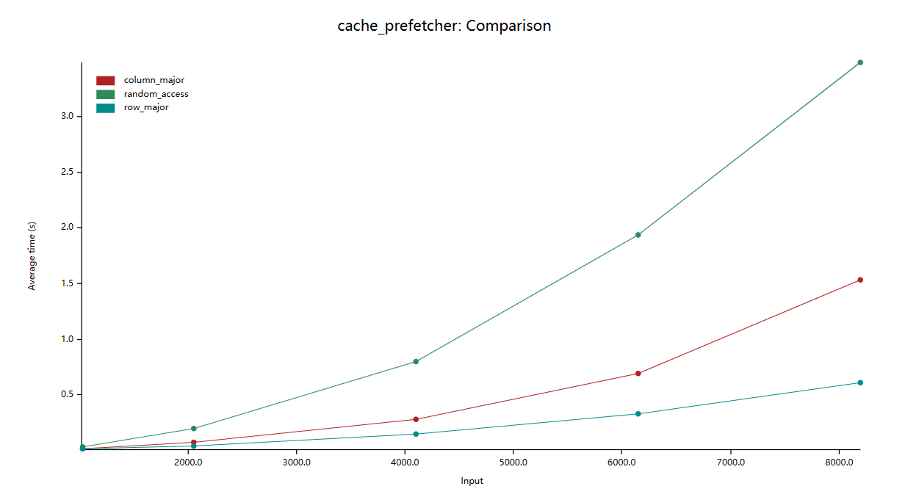

# 每个程序员都应该建立的硬件心智模型

在追求高效代码的路上，我们不可避免地会遇到代码的性能瓶颈。为了了解、解释一段代码为什么低效，并尝试改进低效的代码，我们总是要了解硬件的工作原理。于是，我们可能会尝试搜索有关某个架构的介绍、一些优化指南或者阅读一些计算机科学的教科书（如：计算机组成原理）。但以上的内容可能都太过繁琐、细节太多，在阅读的过程中，我们可能会迷失在纷繁的细节中，没法很好地将知识运用到实践中。


本文旨在通过多个可运行的 `benchmark` 介绍常见的优化细节以及与之相关的硬件知识，为读者建立一个简单、有效的硬件心智模型。

## Cache

首先要介绍的就是缓存 `cache` 。我们先来看一个引自 `CSAPP` 的经典例子：

```rust
pub fn row_major_traversal(arr: &mut Vec<Vec<usize>>) {
    let n = arr.len();
    for i in 0..n {
        assert!(arr[i].len() == n);
        for j in 0..n {
            arr[i][j] += j;
        }
    }
}

pub fn column_major_traversal(arr: &mut Vec<Vec<usize>>) {
    let n = arr.len();
    for i in 0..n {
        assert!(arr[i].len() == n);
        for j in 0..n {
            arr[j][i] += j;
        }
    }
}
```

在上面两个例子中，分别按行、按列迭代同样大小的二维数组。


我们对这两个函数进行 `benchmark`：


在上图中，纵轴是平均耗时，横轴是数组大小（如：2000.0 表示数组大小为：`2000 x 2000`）。我们看到按行迭代数组比按列迭代的效率高约 10 倍。

在现代的存储架构中，`cpu` 和主存之间是 `cache` 。`cpu` 中的寄存器、高速缓存、内存三者的数据读写速度越来越慢。


而当 `cpu` 读取一个数据的时候，会先尝试从 `cache` 中读取。如果发生 `cache miss` 的时候，才会将数据从主存中加载到 `cache` 中再读取。而值得注意的是，`cpu` 每一次的读取都是以 `cache line` 为单位的。也就是说，`cpu` 在读取一个数据的时候，也会将该数据相邻的、一个 `cache line` 内的数据也加载到 `cache` 中。而二维数组在内存中是按行排布的，换句话说，数组中相邻的两行是首尾相连排列的。所以在读取 `arr[i]` 的时候，`arr[i + 1]` 、`arr[i + 2]` 等相邻的数组元素也会被加载到 `cache` 中，而当下一次迭代中，需要读取数组元素 `arr[i + 1]` 时，就能直接从 `cache` 中取出，速度非常快。而因为以列读取数组时，`arr[i][j]` 和 `arr[i + 1][j]` 在内存中的位置就不再是紧密相连，而是相距一个数组行大小。这也导致了在读取 `arr[i][j]` 时，`arr[i + 1][j]` 并没有被加载到 `cache` 中。在下一次迭代时就会发生 `cache miss` 也就导致读取速度大幅下降。


### prefetcher

如果我们不再是按某种顺序，而是随机地遍历数组，结果又会如何呢？

```rust
pub fn row_major_traversal(arr: &mut Vec<Vec<usize>>) {
    let n = arr.len();
    for i in 0..n {
        assert!(arr[i].len() == n);
        let ri: usize = rand::random();
        std::intrinsics::black_box(ri);
        for j in 0..n {
            arr[i][j] += j;
        }
    }
}

pub fn column_major_traversal(arr: &mut Vec<Vec<usize>>) {
    let n = arr.len();
    for i in 0..n {
        assert!(arr[i].len() == n);
        let ri: usize = rand::random();
        std::intrinsics::black_box(ri);
        for j in 0..n {
            arr[j][i] += j;
        }
    }
}

pub fn random_access(arr: &mut Vec<Vec<usize>>) {
    let n = arr.len();
    for i in 0..n {
        assert!(arr[i].len() == n);
        for j in 0..n {
            let ri: usize = rand::random();
            arr[j][ri % n] += j;
        }
    }
}
```

理论上来说，随机遍历和按列遍历都会导致频繁地 `cache miss` ，所以两者的效率应该是相近的。接下来，我们进行 `benchmark`：



可以看到，`random_access` 比 `column_major` 的效率还要低了近 7 倍。原因是，在 `cache` 和 `cpu` 间还有 `prefetcher`


我们可以参考维基百科上的资料：

Cache prefetching can be accomplished either by hardware or by software.

-   **Hardware based prefetching** is typically accomplished by having a dedicated hardware mechanism in the processor that watches the stream of instructions or data being requested by the executing program, recognizes the next few elements that the program might need based on this stream and prefetches into the processor's cache.
-   **Software based prefetching** is typically accomplished by having the compiler analyze the code and insert additional "prefetch" instructions in the program during compilation itself.

而 `random_access` 会让 `prefetching` 的机制失效，使得运行效率进一步下降。

### cache associativity

如果我们按照不同的步长迭代一个数组会怎么样呢？

```rust
pub fn iter_with_step(arr: &mut Vec<usize>, step: usize) {
    let n = arr.len();
    let mut i = 0;
    for _ in 0..1000000 {
        unsafe { arr.get_unchecked_mut(i).add_assign(1); }
        i = (i + step) % n;
    }
}
```

`steps` 为：

```rust
let steps = [
    1, 
    2, 
    4, 
    7, 8, 9,
    15, 16, 17,
    31, 32, 33,
    61, 64, 67,
    125, 128, 131,
    253, 256, 259, 
    509, 512, 515, 
    1019, 1024, 1031
];
```

我们进行测试：


可以看见当 `step` 为 2 的幂次时，都会有一个运行时间的突起，一个性能的毛刺。这是为什么呢？要回答这个问题，我们需要温习一些计组知识。

`cache` 的大小是要远小于主存的。这就意味着我们需要通过某种方式将主存的不同位置映射到缓存中。一般来说，共有 3 种不同的映射方式。

#### 全相联映射

全相联映射允许主存中的行可以映射到缓存中的任意一行。这种映射方式灵活性很高，但会使得缓存的查找速度下降。

#### 直接映射

直接映射则规定主存中的某一行只能映射到缓存中的特定行。这种映射方式查找速度高，但灵活性很低，会经常导致缓存冲突，从而导致频繁 `cache miss` 。

#### 组相联映射

组相联映射则尝试吸收前两者的优点，将缓存中的缓存行分组，主存中某一行只能映射到特定的一组，在组内则采取全相联的映射方式。如果一组之内有 `n` 个缓存行，我们就称这种映射方式为 `n` 路组相联（n-way set associative）。


回到真实的 `cpu` 中，如：`AMD Ryzen 7 4700u` 。


我们可以看到，`L1 cache` 大小为 `4 x 32 KB (128KB)`   ，采取 8 路组相联，缓存行大小为 `64 bytes` 。也就是说，该缓存共有 `4x32x1024 byte/64 byte = 2048` 行，共分为 `2048/8 = 256` 组。也就是说，当迭代数组的步长为 $2^n$ 时，数据更可能会被分到同一个组内，导致 `cache miss` 更加频繁，从而导致效率下降。

（注：我的 `cpu` 是 `intel i7-10750H` ，算得的 `L1 cache` 的组数为 `384` ，并不能很好地用理论解释。）


### false share

我们再来观察一组 `benchmark` 。

```rust
use std::sync::atomic::{AtomicUsize, Ordering};
use std::thread;

fn increase(v: &AtomicUsize) {
    for _ in 0..10000 {
        v.fetch_add(1, Ordering::Relaxed);
    }
}

pub fn share() {
    let v = AtomicUsize::new(0);
    thread::scope(|s| {
        let ta = s.spawn(|| increase(&v));
        let tb = s.spawn(|| increase(&v));
        let tc = s.spawn(|| increase(&v));
        let td = s.spawn(|| increase(&v));

        ta.join().unwrap();
        tb.join().unwrap();
        tc.join().unwrap();
        td.join().unwrap();
    });
}

pub fn false_share() {
    let a = AtomicUsize::new(0);
    let b = AtomicUsize::new(0);
    let c = AtomicUsize::new(0);
    let d = AtomicUsize::new(0);

    thread::scope(|s| {
        let ta = s.spawn(|| increase(&a));
        let tb = s.spawn(|| increase(&b));
        let tc = s.spawn(|| increase(&c));
        let td = s.spawn(|| increase(&d));

        ta.join().unwrap();
        tb.join().unwrap();
        tc.join().unwrap();
        td.join().unwrap();
    });
}
```

在 `share` 函数中，四个线程同时竞争原子变量 `v` 。而在 `false_share` 函数中，四个线程分别操作不同的原子变量，理论上线程之间不会产生数据竞争，所以 `false_share` 的执行效率应该比 `share` 要高。但 `benchmark` 的结果却出乎意料：


可以看到 `false_share` 比 `share` 的执行效率还要低。

在前文中提到，`cpu` 在读取数据时，是以一个 `cache line` 大小为单位将数据从主存中加载到 `cache` 中的。在前文中提到，笔者机器的 `cache line` 大小为：`64 bytes` 。而 `false_share` 函数中，四个原子变量在栈中的排布可能是：


`a`, `b`, `c`, `d` 四个原子变量在同一个 `cache line` 中，也就是说实际上四个线程实际上还是发生了竞争，产生了 `false share` 的现象。

那要如何解决这个问题呢？我们可以采用 `#[repr(align(64))]` （在不同的编程语言中又不同的写法），告知编译器将原子变量的内存地址以一个 `cache line` 大小对齐，从而避免四个原子变量位于同一个 `cache line` 中。

```rust
fn increase_2(v: &AlignAtomicUsize) {
    for _ in 0..10000 {
        v.v.fetch_add(1, Ordering::Relaxed);
    }
}

#[repr(align(64))]
struct AlignAtomicUsize {
    v: AtomicUsize,
}

impl AlignAtomicUsize {
    pub fn new(val: usize) -> Self {
        Self { v: AtomicUsize::new(val) }
    }
}

pub fn non_share() {
    let a = AlignAtomicUsize::new(0);
    let b = AlignAtomicUsize::new(0);
    let c = AlignAtomicUsize::new(0);
    let d = AlignAtomicUsize::new(0);

    thread::scope(|s| {
        let ta = s.spawn(|| increase_2(&a));
        let tb = s.spawn(|| increase_2(&b));
        let tc = s.spawn(|| increase_2(&c));
        let td = s.spawn(|| increase_2(&d));

        ta.join().unwrap();
        tb.join().unwrap();
        tc.join().unwrap();
        td.join().unwrap();
    });
}
```

我们再次进行 `benchmark`，这一次 `benchmark` 的结果就符合我们的预测了：


可以看见 `non_share` 相比前两者，提升了近乎两倍的效率。

## pipeline

我们再看一个 `benchmark`：

```rust
pub trait Get {
    fn get(&self) -> i32;
}

struct Foo { /* ... */ }
struct Bar { /* ... */ }

impl Get for Foo { /* ... */ }
impl Get for Bar { /* ... */ }

let mut arr: Vec<Box<dyn Get>> = vec![];
for _ in 0..10000 {
    arr.push(Box::new(Foo::new()));
}
for _ in 0..10000 {
    arr.push(Box::new(Bar::new()));
}

// 此时数组中元素的排列时有序的
arr.iter().filter(|v| v.get() > 0).count()

// 将数组打乱
arr.shuffle(&mut rand::thread_rng());

// 再次测试
arr.iter().filter(|v| v.get() > 0).count()
```

测试结果为：


可以看见，`sorted` 和 `unsorted` 之间效率差约 2.67 倍。这是因为频繁的分支预测失败导致的。

在`CPU` 中，每一条指令的执行都会分为多个步骤，而现代计算机架构中存在一个结构 `pipeline` 可以同时执行处于不同执行阶段的指令。


而 `pipeline` 要高效地工作，需要在执行指令 `A` 时就将接下来要执行的指令 `B`, `C`, `D` 等提前读入。在一般的代码中，`pipeline` 可以有效地工作，但遇到分支的时候，我们就遇到难题了：


如图，`pipeline` 应该读入 `Code A` 还是 `Code B` 呢？在执行分支语句前，谁也不知道，`CPU` 也是。如果我们还想要 `pipeline` 高效工作的话，我们就只剩下一条路：猜。只要猜得足够准，我们的效率就能够接近没有分支的情况。“猜”这一步也有一个专业名词——**`流水线冒险`**。而现代计算机在编译器配合以及一些算法的帮助下，某些分支（如下图所示）的预测成功率可以高达 99% 。


分支预测失败的代价是要付出代价的。首先，我们要清除 `pipeline` 中的指令，因为它们不是接下来要执行的指令。其次，我们要将接下来要执行的指令一一加载进 `pipeline` 。最后，指令经过多个步骤被执行。

在测试代码中，我们打乱数组后，就会导致分支预测频繁失败，最终导致了执行效率的下降。

## 数据依赖

我们再来看一段代码：

```rust
pub fn dependent(a: &mut Vec<i32>, b: &mut Vec<i32>, c: &Vec<i32>) {
    assert!(a.len() == 100000);
    assert!(b.len() == 100000);
    assert!(c.len() == 100000);

    for i in 0..=99998 {
        a[i] += b[i];
        b[i + 1] += c[i];
    }
    a[9999] += b[9999];
}

pub fn independent(a: &mut Vec<i32>, b: &mut Vec<i32>, c: &Vec<i32>) {
    assert!(a.len() == 100000);
    assert!(b.len() == 100000);
    assert!(c.len() == 100000);

    a[0] += b[0];
    for i in 0..=99998 {
        b[i + 1] += c[i];
        a[i + 1] += b[i + 1];
    }
}
```

在这段代码中，我们通过两种不同的方式迭代数组，并最终达成一致的效果。我们画出，数据流图如下图：


在上图中，我们用箭头表示依赖关系（`a[0] -> b[0]` 表示 `a[0]` 的结果依赖于 `b[0]` ），用黑色箭头表示在循环外进行的操作，用不同的颜色，表示不同迭代中的操作。我们可以看到，在 `dependent` 中，不同颜色的箭头会出现在同一个数据流中，如：（`a[1]->b[1]->c[0]` 中就出现了红色和蓝色箭头），这就意味着第 `n + 1` 次迭代会依赖于第 `n` 次迭代的结果，而 `independent` 中则没有这种情况。

这会产生什么影响呢？我们来进行测试：


可以看到，出现了近 3 倍的效率差距。这有两方面原因。

一是数据依赖会导致 `pipeline` 效率以及 `cpu` 指令级并行的效率变低。


二是这种迭代之间的依赖会阻止编译器的向量化优化。我们观察等价的 `cpp` 代码（`rust 1.71` 的优化能力并不足以将 `independet` 向量化，我略感悲伤）。

```cpp
#include <vector>

using i32 = int;

template<typename T>
using Vec = std::vector<T>;

void dependent(Vec<i32> &a, Vec<i32> &b, Vec<i32> &c) {
    for (int i = 0; i < 9999; i++) {
        a[i] += b[i];
        b[i + 1] += c[i];
    }
    a[9999] += b[9999];
}

void independent(Vec<i32> &a, Vec<i32> &b, Vec<i32> &c) {
    a[0] += b[0];
    for (int i = 0; i < 9999; i++) {
        b[i + 1] += c[i];
        a[i + 1] += b[i + 1];
    }
}
```

查看汇编：

```asm
dependent(...):
    mov     rax, rdx
    mov     rdx, QWORD PTR [rsi]
    mov     rcx, QWORD PTR [rdi]
    mov     rdi, QWORD PTR [rax]
    xor     eax, eax
.L2:
    mov     esi, DWORD PTR [rdx+rax]
    add     DWORD PTR [rcx+rax], esi
    mov     esi, DWORD PTR [rdi+rax]
    add     DWORD PTR [rdx+4+rax], esi
    add     rax, 4
    cmp     rax, 39996
    jne     .L2
    mov     eax, DWORD PTR [rdx+39996]
    add     DWORD PTR [rcx+39996], eax
    ret

independent(...):
    mov     rax, QWORD PTR [rdi]
    mov     rcx, rdx
    mov     rdx, QWORD PTR [rsi]
    lea     rdi, [rax+4]
    mov     esi, DWORD PTR [rdx]
    add     DWORD PTR [rax], esi
    lea     r8, [rdx+4]
    mov     rsi, QWORD PTR [rcx]
    lea     rcx, [rdx+20]
    cmp     rdi, rcx
    lea     rdi, [rax+20]
    setnb   cl
    cmp     r8, rdi
    setnb   dil
    or      ecx, edi
    mov     rdi, rdx
    sub     rdi, rsi
    cmp     rdi, 8
    seta    dil
    test    cl, dil
    je      .L9
    mov     rcx, rax
    sub     rcx, rsi
    cmp     rcx, 8
    jbe     .L9
    mov     ecx, 4
.L7:
    movdqu  xmm0, XMMWORD PTR [rsi-4+rcx]
    movdqu  xmm2, XMMWORD PTR [rdx+rcx]
    paddd   xmm0, xmm2
    movups  XMMWORD PTR [rdx+rcx], xmm0
    movdqu  xmm3, XMMWORD PTR [rax+rcx]
    paddd   xmm0, xmm3
    movups  XMMWORD PTR [rax+rcx], xmm0
    add     rcx, 16
    cmp     rcx, 39988
    jne     .L7
    movq    xmm0, QWORD PTR [rsi+39984]
    movq    xmm1, QWORD PTR [rdx+39988]
    paddd   xmm0, xmm1
    movq    QWORD PTR [rdx+39988], xmm0
    movq    xmm1, QWORD PTR [rax+39988]
    paddd   xmm1, xmm0
    movq    QWORD PTR [rax+39988], xmm1
    mov     ecx, DWORD PTR [rdx+39996]
    add     ecx, DWORD PTR [rsi+39992]
    mov     DWORD PTR [rdx+39996], ecx
    add     DWORD PTR [rax+39996], ecx
    ret
.L9:
    mov     ecx, 4
.L6:
    mov     edi, DWORD PTR [rdx+rcx]
    add     edi, DWORD PTR [rsi-4+rcx]
    mov     DWORD PTR [rdx+rcx], edi
    add     DWORD PTR [rax+rcx], edi
    add     rcx, 4
    cmp     rcx, 40000
    jne     .L6
    ret
```
可以看到，`independent` 函数被成功向量化。

## 总结

本文以多个 `benchmark` 驱动，讲述了常见的优化手段，帮助读者建立起简答、有效的硬件心智模型。

> 内容来源：CppCon 2016: Timur Doumler “Want fast C++? Know your hardware!"
> 内容链接：https://www.youtube.com/watch?v=BP6NxVxDQIs
